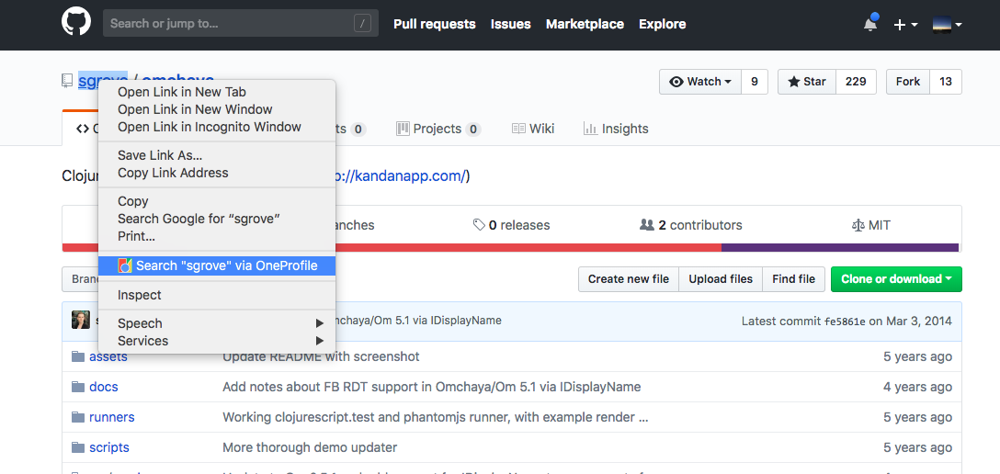
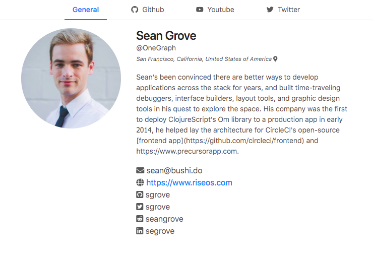
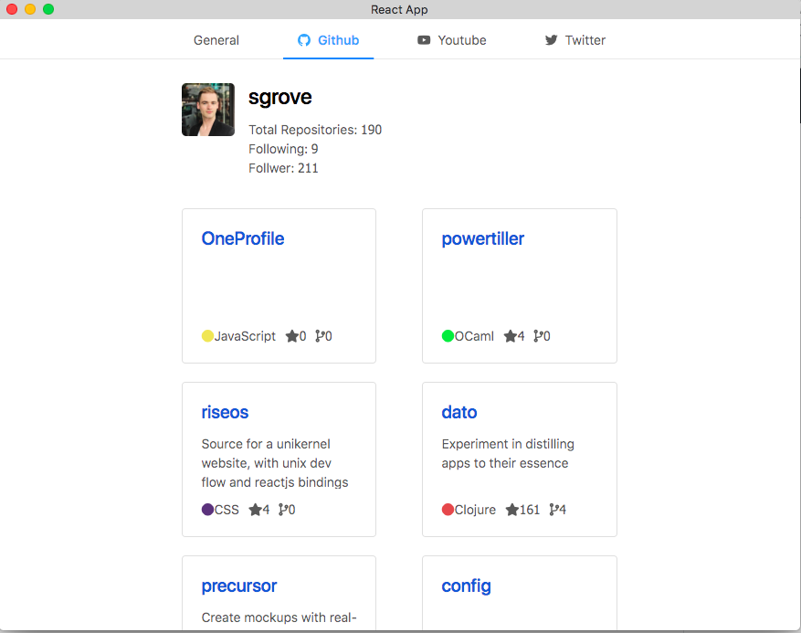
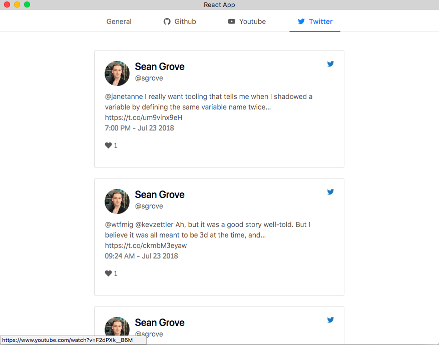

# OneProfile

## Setup a OneGraph app:

We recommend you make a new app, but you can use current OneGraph app ID as well.

Sign up at https://www.onegraph.com, create an app, and grab its id.

Open `src/App.js` and put the APP_ID in there.

## Loading the Chrome extension:

### 1. Build the chrome extension folder;

```
yarn build
```

### 2. Add extension in developer mode

a) Open the Extension Management page at chrome://extensions.

b) Upload react_extension/build by clicking on the LOAD UNPACKED button. (Make sure you are in Developer mode)

c) If you are running this project in your own OneGraph project, remember to add chrome-extension://<extension-ID> to your app's CORS origins.

## Examples






